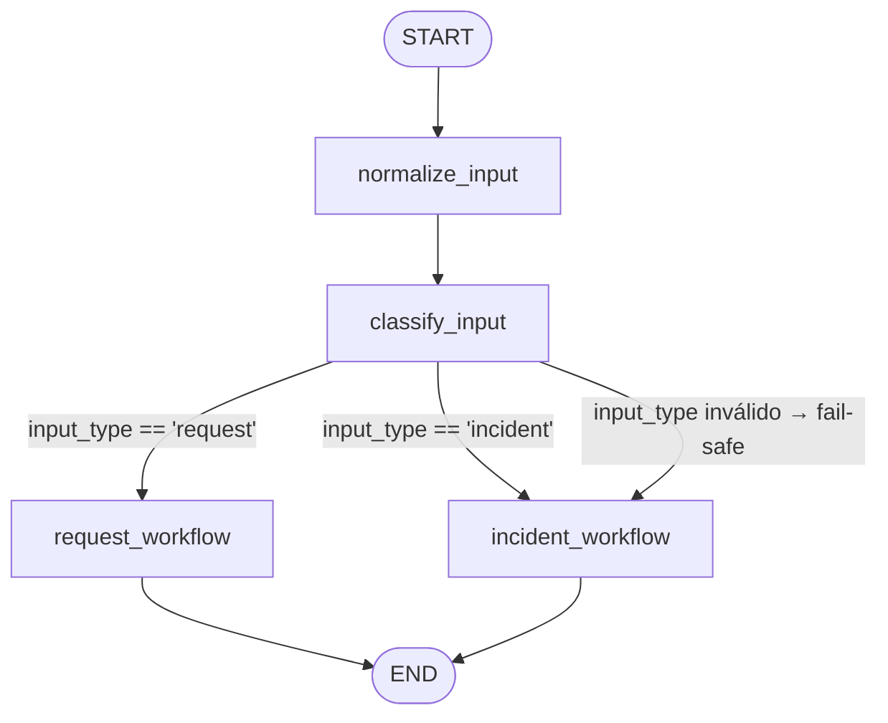
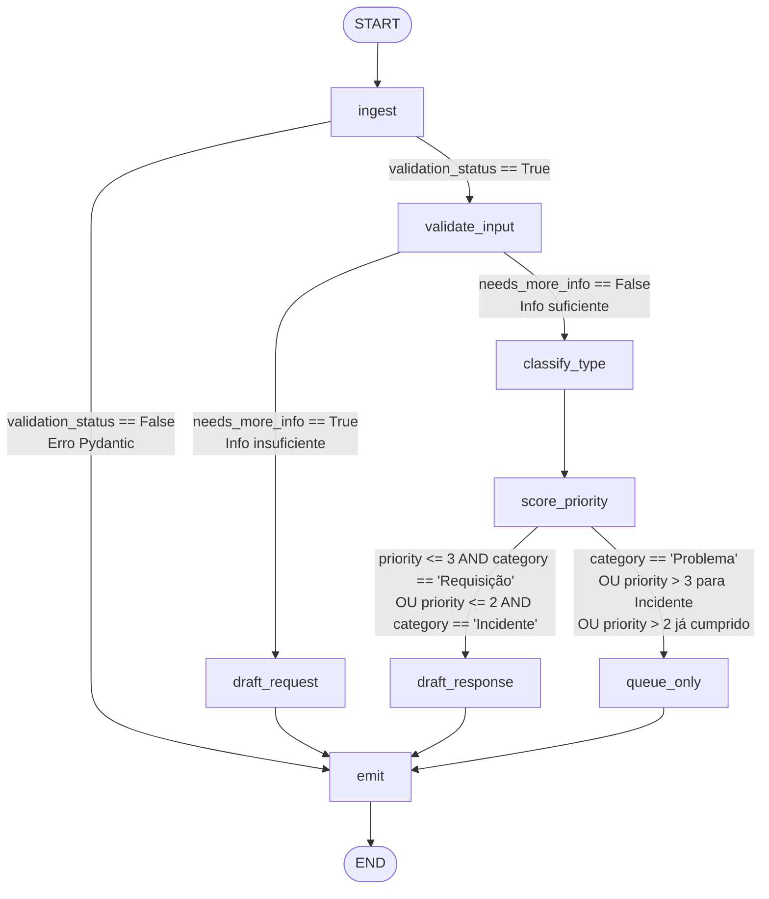
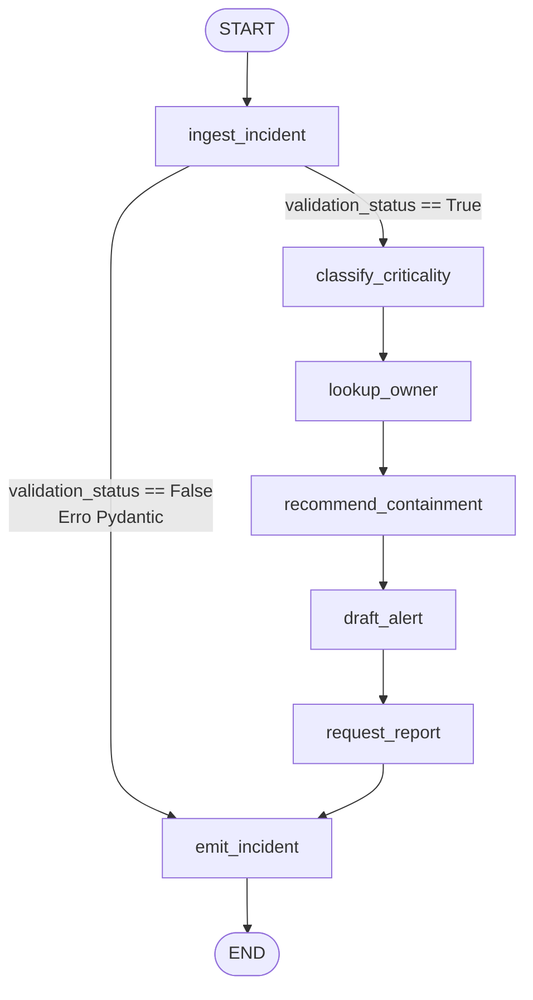

# Hackathon Meta 3 — UFMS Apoia MDA

> Deep dive técnico na arquitetura de grafos, estados, nós, roteamento condicional e mecânica de subgrafos dos Processos 3.1 e 3.5.

---

## Arquitetura Macro — Grafo Pai + Subgrafos

O sistema é estruturado em **três grafos LangGraph**:

1. **Grafo Pai** (`general_process/`) — recebe qualquer entrada de texto, normaliza, classifica como chamado de suporte (`request`) ou incidente de segurança (`incident`) e delega ao subgrafo correto.
2. **Subgrafo 3.1** (`process_request/`) — triagem completa de chamados de suporte de TIC.
3. **Subgrafo 3.5** (`process_incident/`) — triagem completa de incidentes de segurança da informação.

Os subgrafos são compilados com `lru_cache` (singleton thread-safe) e invocados como **nós do grafo pai** via funções wrapper (`request_workflow`, `incident_workflow`). O mapeamento de estado entre grafo pai e subgrafos é feito explicitamente nessas funções wrapper (ver Seção 5).

---

## GRAFO PAI — `general_process`

### 1. 📊 Diagrama de Fluxo



### 2. 🗃️ Modelagem de Estado

**Arquivo:** `general_process/core/state/state.py`

```python
class State(TypedDict, total=False):
    raw_input: dict
    input_type: Literal["request", "incident"]
    input_justification: str
    result: dict
```

| Variável | Tipo | Finalidade |
|---|---|---|
| `raw_input` | `dict` | Dicionário raw com os campos do ticket/incidente de entrada (id, timestamp, free_text, etc.). Preenchido externamente antes de invocar o grafo. |
| `input_type` | `Literal["request", "incident"]` | Classificação do tipo de entrada, produzida pelo nó `classify_input`. Determina qual subgrafo será executado. |
| `input_justification` | `str` | Justificativa textual produzida pelo LLM para a classificação `input_type`. Serve para auditoria. |
| `result` | `dict` | Resultado final do subgrafo (request ou incident), serializado de volta ao estado pai pelo nó wrapper. |

> **Nota:** `total=False` significa que todos os campos são opcionais na criação do dicionário, o que é necessário para que o LangGraph consiga construir o estado incrementalmente a cada nó.

### 3. 🧠 Anatomia dos Nós

---

#### Nó `normalize_input`
**Arquivo:** `general_process/core/nodes/normalize_input.py`

**Objetivo:** Pré-processar o texto livre da entrada antes de qualquer chamada ao LLM. Reduz ruído textual (maiúsculas, acentos, espaços redundantes) para uniformizar a superfície de análise do classificador.

**Engenharia de Prompt:** Não invoca LLM. É uma função pura de transformação de texto via `normalize_text()`.

**Mutação de Estado:**
- **Lê:** `state["raw_input"]["free_text"]`
- **Escreve:** `state["raw_input"]` (dicionário atualizado com o `free_text` normalizado; os demais campos permanecem intactos)

---

#### Nó `classify_input`
**Arquivo:** `general_process/core/nodes/classify_input.py`

**Objetivo:** Classificar a entrada como `"request"` (chamado de suporte TIC) ou `"incident"` (incidente de segurança), usando LLM com temperatura 0 para determinismo máximo.

**Engenharia de Prompt:** (`general_process/prompts/classify_input_prompt.md`)

O prompt define a persona de "IT input classifier for UFMS" e estabelece duas categorias mutuamente exclusivas:
- `"request"`: suporte operacional, problemas de acesso, instalações, dúvidas técnicas.
- `"incident"`: ataques cibernéticos, phishing, ransomware, acesso não autorizado, vazamento de dados.

A instrução de desempate é explícita: *"Se o usuário suspeita de acesso não autorizado → incident; se simplesmente perdeu acesso ou esqueceu credencial → request."* O prompt inclui 6 exemplos few-shot (4 claros + 2 de borda/ambíguos) e exige retorno em JSON puro: `{ "input_type": "...", "input_type_justification": "..." }`.

**Mutação de Estado:**
- **Lê:** `state["raw_input"]["free_text"]`
- **Escreve:** `state["input_type"]`, `state["input_justification"]`

---

#### Nó `request_workflow` (Wrapper)
**Arquivo:** `general_process/core/nodes/request_workflow.py`

**Objetivo:** Atuar como nó-tradutor (bridge) entre o grafo pai e o subgrafo 3.1. Extrai o `raw_input` do estado pai, invoca o subgrafo compilado com o estado inicial correto e armazena o resultado de volta no estado pai.

**Engenharia de Prompt:** Não invoca LLM diretamente. Toda a inteligência está no subgrafo 3.1.

**Mecânica de tradução de estado (mapeamento explícito):**
```python
# Estado do pai → Estado do filho (3.1)
raw_input = dict(state.get("raw_input") or {})
result = request_subgraph.invoke({"ticket": raw_input})
# Estado do filho → Estado do pai
return {"result": result}
```
O `raw_input` do pai é passado como `ticket` para o subgrafo, pois o `RequestState` espera a chave `ticket`. O retorno completo do subgrafo (já com `response` preenchido) é armazenado em `state["result"]`.

**Mutação de Estado:**
- **Lê:** `state["raw_input"]`
- **Escreve:** `state["result"]`

---

#### Nó `incident_workflow` (Wrapper)
**Arquivo:** `general_process/core/nodes/incident_workflow.py`

**Objetivo:** Idêntico ao `request_workflow`, mas para o subgrafo 3.5. Mapeia `raw_input` → `incident` e armazena o resultado.

**Mecânica de tradução de estado:**
```python
# Estado do pai → Estado do filho (3.5)
raw_input = dict(state.get("raw_input") or {})
result = incident_subgraph.invoke({"incident": raw_input})
# Estado do filho → Estado do pai
return {"result": result}
```

**Mutação de Estado:**
- **Lê:** `state["raw_input"]`
- **Escreve:** `state["result"]`

---

### 4. 🔀 Roteamento e Edges Condicionais

**Função:** `general_process/utilities/decide_input.py`

```python
def decide_input(state: State) -> str:
    input_type = state.get("input_type")
    if input_type not in {"request", "incident"}:
        logger.error(f"input_type inválido: '{input_type}'. Aplicando fail-safe.")
        return "incident"   # fail-safe conservador
    return input_type
```

**Lógica de decisão:**

| Condição | Próximo Nó | Justificativa |
|---|---|---|
| `input_type == "request"` | `request_workflow` | Fluxo normal para chamados de suporte |
| `input_type == "incident"` | `incident_workflow` | Fluxo normal para incidentes de segurança |
| `input_type` ausente ou inválido | `incident_workflow` | **Fail-safe:** em caso de falha do LLM classificador, a entrada é tratada como incidente (caminho mais conservador/seguro) |

---

---

## PROCESSO 3.1 — Triagem de Chamados de Suporte de TIC

### 1. 📊 Diagrama de Fluxo



### 2. 🗃️ Modelagem de Estado

O subgrafo 3.1 usa **dois TypedDicts compostos** (`RequestState = State`):

**`Ticket`** — `process_request/core/state/ticket.py`

| Campo | Tipo | Finalidade |
|---|---|---|
| `id` | `str` | Identificador único do chamado (gerado via `uuid4()` se ausente) |
| `timestamp` | `str` | Data/hora de abertura do chamado (ISO 8601) |
| `channel` | `str` | Canal de entrada: "Sistema de Chamados", "Telefone", "Balcão", "E-mail" |
| `requester_profile` | `str` | Perfil do solicitante: "Estudante", "Professor", "Técnico-Administrativo" |
| `free_text` | `str` | Texto livre digitado pelo usuário — campo central de análise |
| `needs_more_info` | `bool` | Flag escrita por `validate_input`: `True` se o chamado é insuficiente para triagem |
| `info_justification` | `str` | Justificativa textual do LLM para o `needs_more_info` |

**`Response`** — `process_request/core/state/response.py`

| Campo | Tipo | Finalidade |
|---|---|---|
| `ticket_id` | `str` | Referência ao `Ticket.id` original |
| `category` | `str` | Categoria do chamado: "Requisição", "Incidente" ou "Problema" |
| `category_justification` | `str` | Justificativa textual do LLM para a categoria |
| `urgency` | `int` | Pontuação de urgência (1–5) calculada pelo LLM (escala ITIL) |
| `impact` | `int` | Pontuação de impacto (1–5) calculada pelo LLM (escala ITIL) |
| `resulting_priority` | `int` | Prioridade resultante (1–5) calculada deterministicamente em Python |
| `priority_justification` | `str` | Justificativa textual do LLM para a prioridade resultante |
| `service_type` | `str` | Tipo de serviço do Catálogo de TIC (ex: "Passaporte UFMS", "Wi-fi UFMS") |
| `support_level` | `int` | Nível de suporte recomendado: 1 (N1), 2 (N2) ou 3 (N3) |
| `department` | `str` | Setor da AGETIC responsável (ex: "N1 - Atendimento Direto") |
| `response_draft` | `str` | Rascunho da resposta ao usuário gerado pelo LLM |
| `closing_message` | `Optional[str]` | Mensagem padrão de encerramento com contatos da AGETIC |
| `validation_status` | `bool` | `True` se o chamado passou na validação Pydantic; `False` caso contrário |

### 3. 🧠 Anatomia dos Nós

---

#### Nó `ingest`
**Arquivo:** `process_request/core/nodes/ingest.py`

**Objetivo:** Primeiro portão de entrada do subgrafo. Valida o dicionário bruto do ticket usando o modelo Pydantic `IngestTicket`, garantindo que os campos obrigatórios existam e tenham os tipos corretos antes de qualquer chamada ao LLM.

**Engenharia de Prompt:** Não invoca LLM. Lógica determinística com Pydantic v2.

**Modelo Pydantic `IngestTicket`** (`process_request/utilities/ingest_ticket.py`):
```python
class IngestTicket(BaseModel):
    id: str                         # obrigatório; gerado via uuid4() se ausente
    timestamp: datetime             # validado como datetime ISO 8601
    channel: str = Field(min_length=1)
    requester_profile: str = Field(min_length=1)
    free_text: str = Field(min_length=2)
```

**Comportamento em caso de falha:** Se `ValidationError` for levantado, o nó escreve o JSON do erro em `response.response_draft` e seta `response.validation_status = False`. O próximo edge condicional (`validation_response`) detecta isso e encaminha diretamente para `emit`, pulando toda a cadeia de LLM.

**Mutação de Estado:**
- **Lê:** `state["ticket"]` (raw dict)
- **Escreve (sucesso):** `state["ticket"]` (dict normalizado pelo Pydantic), `state["response"]["validation_status"] = True`
- **Escreve (falha):** `state["response"]["response_draft"]` (erro JSON), `state["response"]["validation_status"] = False`

---

#### Nó `validate_input`
**Arquivo:** `process_request/core/nodes/validate_input.py`

**Objetivo:** Avaliar semanticamente se o texto livre do chamado contém informação suficiente para que a triagem subsequente (categorização, priorização) produza resultados confiáveis. Também detecta emergências críticas que devem pular a coleta de informação.

**Engenharia de Prompt:** (`process_request/prompts/validate_input_prompt.md`)

Persona: "Level 1 IT triage analyst at UFMS." O prompt define dois critérios distintos:

*Emergência Crítica* (`is_critical_emergency: true`): danos físicos iminentes à infraestrutura (água em servidores, incêndio, faíscas elétricas), ataques cibernéticos ativos (phishing, DDoS, malware), ou qualquer cenário em que aguardar mais informação causaria dano grave e irreversível.

*Informação Insuficiente* (`needs_more_info: true`): texto genérico demais para identificar o sistema afetado, a natureza do problema ou para inferir urgência/impacto. Exemplos explícitos de insuficiência: "não funciona", "ajuda urgente", "problema no sistema", "erro aqui".

O retorno é JSON puro: `{ "needs_more_info": bool, "is_critical_emergency": bool, "info_justification": "..." }`.

**Mutação de Estado:**
- **Lê:** `state["ticket"]["free_text"]`
- **Escreve:** `state["ticket"]["needs_more_info"]`, `state["ticket"]["info_justification"]`

---

#### Nó `classify_type`
**Arquivo:** `process_request/core/nodes/classify_type.py`

**Objetivo:** Categorizar o chamado em Requisição / Incidente / Problema, identificar o tipo de serviço exato do Catálogo de TIC, o setor da AGETIC responsável e o nível de suporte (N1/N2/N3).

**Engenharia de Prompt:** (`process_request/prompts/classify_type_prompt.md`)

Persona: "Level 1 IT triage analyst at UFMS." Este é o prompt mais extenso e estruturado do projeto. Define:

- **Regras de categoria:** "Requisição" = pedido planejado (acesso, instalação, configuração); "Incidente" = falha inesperada que afeta operação normal; "Problema" = questão recorrente ou de grande escala que exige análise mais profunda.

- **Catálogo de Serviços (19 entradas):** Cada entrada do catálogo define a tripla exata `(service_type, department, support_level)`. Por exemplo: `"Passaporte UFMS" → "N1 - Atendimento Direto" → support_level 1`; `"Wi-fi UFMS" → "N3 - Infraestrutura e Redes" → support_level 3`. O agente é instruído a usar EXATAMENTE um valor da lista, sem inventar.

- **Formato de saída JSON:** `{ "category", "service_type", "support_level", "category_justification", "department" }`. Os campos `urgency`, `impact`, `resulting_priority` e `response_draft` estão explicitamente proibidos neste nó.

O prompt inclui 3 exemplos few-shot com tickets reais da UFMS.

**Mutação de Estado:**
- **Lê:** `state["ticket"]["free_text"]`
- **Escreve:** `state["response"]["ticket_id"]`, `state["response"]["category"]`, `state["response"]["service_type"]`, `state["response"]["support_level"]`, `state["response"]["category_justification"]`, `state["response"]["department"]`

---

#### Nó `score_priority`
**Arquivo:** `process_request/core/nodes/score_priority.py`

**Objetivo:** Calcular a prioridade do chamado de forma híbrida: urgência e impacto são avaliados pelo LLM **em paralelo** via `ThreadPoolExecutor`, a prioridade resultante é calculada **deterministicamente** em Python, e a justificativa é gerada pelo LLM sequencialmente. Este nó implementa o padrão de fail-safe mais robusto do projeto.

**Engenharia de Prompt (3 prompts distintos):**

**`score_urgency_prompt.md`** — Persona: "Senior IT Service Desk Manager applying ITIL methodologies." Rubrica de urgência (1–5):
- 1: Baixa/Planejada (instalação semana que vem, dúvidas)
- 2: Média (usuário consegue trabalhar com alternativa)
- 3: Alta (trabalho severamente prejudicado, prazo próximo)
- 4: Muito Alta / Crítica (aula ao vivo parada, sistema core fora agora)
- 5: Emergência (ataque cibernético ativo, perigo físico como fogo/faíscas)

**`score_impact_prompt.md`** — Mesma persona. Rubrica de impacto (1–5):
- 1: Único usuário/dispositivo
- 2: Múltiplos usuários / sala única
- 3: Departamento/Prédio ou serviço importante
- 4: Campus inteiro ou sistema core fora
- 5: Desastre empresarial ou brecha de segurança

Ambas as rubricas têm **regras críticas imutáveis**: ataques de segurança → urgência 5 e impacto 5; problemas físicos para uma pessoa → impacto 1; vazamentos de dados ou ataques → impacto 5.

**`justify_priority_prompt.md`** — Persona: "Senior IT Service Desk Manager." Instrui a produzir justificativa em PT-BR de 2–3 frases mencionando explicitamente escala (impacto) e sensibilidade temporal (urgência). Mapeamento de prioridade: 1=Baixa, 2=Média, 3=Alta, 4=Crítica, 5=Imediata.

**Fórmula determinística de prioridade:**
```python
def _calculate_priority(urgency: int, impact: int) -> int:
    raw = (max(urgency, impact) + round((urgency + impact) / 2)) / 2
    return max(1, min(5, round(raw)))
```
Usa o máximo entre urgência e impacto como base, suavizado pela média aritmética, sempre dentro de [1, 5].

**Mecanismo de fail-safe:** Se o LLM falhar em retornar `urgency` ou `impact`, o nó:
1. Registra o erro com `logger.error()`
2. Define `urgency = 2`, `impact = 2` (valores conservadores)
3. Força `resulting_priority = 5` (prioridade máxima — escala para humano)
4. Escreve `llm_error` no estado com descrição do campo falho
5. Retorna o estado — o edge condicional seguinte detecta prioridade 5 e encaminha para `queue_only`

**Mutação de Estado:**
- **Lê:** `state["ticket"]["free_text"]`, `state["ticket"]["id"]`
- **Escreve:** `state["response"]["urgency"]`, `state["response"]["impact"]`, `state["response"]["resulting_priority"]`, `state["response"]["priority_justification"]` (e opcionalmente `state["response"]["llm_error"]` em caso de falha)

---

#### Nó `draft_response`
**Arquivo:** `process_request/core/nodes/draft_response.py`

**Objetivo:** Gerar o rascunho de resposta ao usuário para chamados elegíveis à resposta automática (baixa/média complexidade). Usa few-shot dinâmico construído com base no departamento identificado pelo `classify_type`.

**Engenharia de Prompt:** (`process_request/prompts/draft_response_prompt.md`)

Persona: "AI acting as a Level 1 IT Support Analyst for AGETIC/UFMS." Regras centrais:
- O `response_draft` final **DEVE** ser em PT-BR natural e fluente.
- **Anti-alucinação:** NÃO inventar etapas de troubleshooting, URLs, sistemas ou SLAs. Usar apenas o Catálogo de Serviços fornecido no prompt.
- Tom: cordial, profissional, objetivo, máximo 100 palavras.
- Estrutura da resposta: saudação → confirmação do pedido → orientação baseada no catálogo ou pergunta específica de esclarecimento → fechamento com ANS.

O Catálogo de Serviços completo (17 serviços com URLs, e-mails e ANS) está embutido no system prompt. Exemplos: "Passaporte UFMS: acesse passaporte.ufms.br, clique em 'Criar meu Passaporte' ou 'Recuperar Senha'. ANS: 12 horas."

O few-shot dinâmico (`build_few_shot(department)`) fornece exemplos de respostas já escritas para o mesmo departamento, aumentando a aderência ao tom institucional.

**Mutação de Estado:**
- **Lê:** `state["ticket"]["free_text"]`, `state["response"]["department"]`
- **Escreve:** `state["response"]["response_draft"]`

---

#### Nó `draft_request`
**Arquivo:** `process_request/core/nodes/draft_request.py`

**Objetivo:** Quando `validate_input` detecta informação insuficiente, este nó gera uma mensagem de retorno ao usuário solicitando **especificamente** o dado faltante — sem fazer perguntas genéricas.

**Engenharia de Prompt:** (`process_request/prompts/draft_request_prompt.md`)

Persona: "Level 1 IT Support Analyst for UFMS." Regras centrais:
- NUNCA fazer perguntas genéricas como "qual sistema/plataforma?" se não forem logicamente aplicáveis ao contexto específico do pedido.
- Sem alucinações: não inventar termos técnicos, sistemas inexistentes ou exemplos falsos.
- PT-BR natural, profissional. Sem templates robóticos. Não pedir desculpas excessivas.
- Pedir apenas o dado estritamente necessário para avançar.

**Mutação de Estado:**
- **Lê:** `state["ticket"]["free_text"]`
- **Escreve:** `state["response"]["response_draft"]`

---

#### Nó `queue_only`
**Arquivo:** `process_request/core/nodes/queue_only.py`

**Objetivo:** Encaminhar chamados de alta complexidade ou alto risco para a fila de analistas humanos. Persiste a entrada na fila JSON para processamento manual posterior.

**Engenharia de Prompt:** Não invoca LLM. Função determinística de serialização.

**Regras de enfileiramento:** Chamados do tipo "Problema" (sempre), chamados do tipo "Incidente" com prioridade > 2, ou qualquer chamado com prioridade > 3 (inclusive Requisições).

**Estrutura do registro na fila:**
```json
{
  "timestamp": "2026-05-18T14:00:00",
  "ticket_id": "TKT-2026-0099",
  "free_text": "...",
  "category": "Problema",
  "priority": 4,
  "department": "N2 - Sistemas Administrativos",
  "reason": "Alta prioridade ou categoria complexa — requer analista humano."
}
```

**Mutação de Estado:**
- **Lê:** `state["ticket"]`, `state["response"]["category"]`, `state["response"]["resulting_priority"]`, `state["response"]["department"]`
- **Escreve:** `state["response"]["response_draft"]` (texto fixo "[FILA HUMANA] Encaminhado ao analista responsável."), persiste em `process_request/data/human_queue.json`

---

#### Nó `emit`
**Arquivo:** `process_request/core/nodes/emit.py`

**Objetivo:** Nó terminal de saída. Serializa o estado final em dois formatos: JSON individual por chamado e CSV acumulativo de todos os chamados processados. Também adiciona a `closing_message` padrão com os contatos da AGETIC.

**Engenharia de Prompt:** Não invoca LLM.

**Artefatos gerados:**
- `process_request/artifacts/responses_json/ticket_<id>.json` — resultado completo por chamado
- `process_request/artifacts/report.csv` — linha adicionada ao CSV acumulativo (append)

**Mutação de Estado:**
- **Lê:** todos os campos de `state["ticket"]` e `state["response"]`
- **Escreve:** `state["response"]` (dict completo com `closing_message` adicionada)

---

### 4. 🔀 Roteamento e Edges Condicionais

O subgrafo 3.1 tem **três edges condicionais**:

---

**Edge 1: após `ingest`**
**Função:** `process_request/utilities/validation_response.py`

```python
def validation_response(state: State) -> str:
    resp = state.get("response") or {}
    if resp.get("validation_status") is False:
        return "emit"
    return "validate_input"
```

| Condição | Destino | Justificativa |
|---|---|---|
| `response.validation_status == False` | `emit` | Ticket com dados inválidos (erro Pydantic) → serializa o erro e encerra sem chamar nenhum LLM |
| Qualquer outro caso | `validate_input` | Ticket válido → segue para validação semântica |

---

**Edge 2: após `validate_input`**
**Função:** `process_request/utilities/decide_content.py`

```python
def decide_content(state: State) -> str:
    needs_more_info = state.get("ticket", {}).get("needs_more_info", False)
    if needs_more_info:
        return "draft_request"
    return "classify_type"
```

| Condição | Destino | Justificativa |
|---|---|---|
| `ticket.needs_more_info == True` | `draft_request` | Ticket vago → gera mensagem pedindo mais detalhes |
| `ticket.needs_more_info == False` | `classify_type` | Ticket com informação suficiente → segue para categorização |

---

**Edge 3: após `score_priority`**
**Função:** `process_request/utilities/decide_response.py`

```python
def decide_response(priority: int, category: str) -> str:
    if (
        (priority <= 3 and normalize_str(category) == "requisicao")
        or
        (priority <= 2 and normalize_str(category) == "incidente")
    ):
        return "draft_response"
    return "queue_only"
```

| Condição | Destino | Justificativa |
|---|---|---|
| Categoria `"Requisição"` **E** prioridade ≤ 3 | `draft_response` | Requisições de baixa/média/alta complexidade podem ser respondidas automaticamente |
| Categoria `"Incidente"` **E** prioridade ≤ 2 | `draft_response` | Incidentes de baixo impacto e baixa urgência também são elegíveis |
| Categoria `"Problema"` (qualquer prioridade) | `queue_only` | **Regra absoluta:** Problemas sempre exigem analista humano — análise especializada não deve ser automatizada |
| Categoria `"Incidente"` **E** prioridade ≥ 3 | `queue_only` | Incidentes de média prioridade ou superior exigem atenção humana |
| Categoria `"Requisição"` **E** prioridade ≥ 4 | `queue_only` | Requisições críticas ou imediatas excedem o escopo da automação |
| Qualquer categoria com `llm_error` (prioridade = 5) | `queue_only` | Fail-safe: erro do LLM → escala para humano |

---

---

## PROCESSO 3.5 — Triagem de Incidentes de Segurança da Informação

### 1. 📊 Diagrama de Fluxo



> **Nota arquitetural importante:** Ao contrário do subgrafo 3.1, o subgrafo 3.5 é **majoritariamente sequencial** após a validação inicial. Não há edges condicionais baseados em conteúdo depois do `ingest_incident`. A criticidade do incidente não bifurca o fluxo — ela apenas muda o *tom e conteúdo* dos nós subsequentes.

### 2. 🗃️ Modelagem de Estado

O subgrafo 3.5 usa **um TypedDict simples** (`IncidentState`):

**`Incident`** — `process_incident/core/state/incident.py`

| Campo | Tipo | Finalidade |
|---|---|---|
| `id` | `str` | Identificador único do incidente (ex: "INC-2026-0001") |
| `timestamp` | `str` | Data/hora do relato (ISO 8601) |
| `free_text` | `str` | Texto livre do relato do incidente — campo central de análise |
| `category` | `str` | Categoria de segurança: "phishing", "malware", "ransomware", "unauthorized_access", "credential_compromise", "suspicious_activity", "denial_of_service", "other" |
| `category_justification` | `str` | Justificativa em PT-BR para a categoria atribuída |
| `critical` | `bool` | `True` se o incidente é crítico (exige resposta em 1h); `False` se não-crítico (4h) |
| `critical_justification` | `str` | Justificativa em PT-BR para o nível de criticidade |
| `scope` | `str` | Escopo de impacto: "usuario_unico", "multiplos_usuarios", "departamento_inteiro", "instituicao_inteira", "desconhecido" |
| `affected_systems` | `str` | Sistemas identificados no relato (ex: "Email Institucional, Passaporte UFMS") |
| `responsible_person` | `str` | Nome do responsável técnico identificado no inventário |
| `contact_info` | `str` | E-mail e telefone do responsável técnico |
| `containment_steps` | `List[str]` | Lista de até 5 passos de contenção recomendados pelo LLM a partir do playbook |
| `containment_justification` | `str` | Justificativa para os passos de contenção escolhidos |
| `alert_draft` | `str` | Rascunho do e-mail de alerta para o responsável técnico |
| `report_template` | `str` | Template estruturado do Relatório Parcial de Incidente em texto puro |
| `validation_status` | `bool` | `True` se passou na validação Pydantic; `False` caso contrário |

### 3. 🧠 Anatomia dos Nós

---

#### Nó `ingest_incident`
**Arquivo:** `process_incident/core/nodes/ingest_incident.py`

**Objetivo:** Portão de entrada do subgrafo 3.5. Valida o dicionário bruto do relato de incidente com o modelo Pydantic `IncidentTicket`.

**Engenharia de Prompt:** Não invoca LLM.

**Modelo Pydantic `IncidentTicket`** (`process_incident/utilities/ingest_incident_ticket.py`):
```python
class IncidentTicket(BaseModel):
    id: str                         # obrigatório; gerado via uuid4() se ausente
    timestamp: datetime             # validado como datetime ISO 8601
    free_text: str = Field(min_length=2)
```
> Observe que `IncidentTicket` é mais permissivo que `IngestTicket` (processo 3.1) — não exige `channel` ou `requester_profile`, pois incidentes de segurança chegam por canais variados e o relato pode ser anônimo.

**Comportamento em caso de falha:** Se `ValidationError`, escreve o JSON do erro em `incident.alert_draft` e seta `incident.validation_status = False`. O edge condicional (`incident_validation`) encaminha diretamente para `emit_incident`.

**Mutação de Estado:**
- **Lê:** `state["incident"]` (raw dict)
- **Escreve (sucesso):** `state["incident"]` (normalizado), `state["incident"]["validation_status"] = True`
- **Escreve (falha):** `state["incident"]["alert_draft"]` (erro JSON), `state["incident"]["validation_status"] = False`

---

#### Nó `classify_criticality`
**Arquivo:** `process_incident/core/nodes/classify_criticality.py`

**Objetivo:** Classificar o incidente de segurança em múltiplas dimensões: criticidade (crítico/não-crítico), categoria técnica, escopo de impacto e sistemas afetados — tudo em uma única chamada LLM.

**Engenharia de Prompt:** (`process_incident/prompts/classify_criticality_prompt.md`)

Persona: "Cybersecurity incident triage assistant for UFMS." O prompt define regras explícitas para cada campo:

**Regras para `critical`:**
- `True` quando: ransomware, cryptolocker, malware confirmado, arquivos encriptados, comprometimento de credenciais, acesso não autorizado, campanhas de phishing, exfiltração de dados, vazamentos, interrupção de serviço institucional, múltiplos usuários afetados.
- `False` quando: eventos isolados, impacto limitado, atividade suspeita mas não confirmada, sem evidência de comprometimento.

**Regras para `category`:** Apenas valores do enum: `"phishing"`, `"malware"`, `"ransomware"`, `"unauthorized_access"`, `"credential_compromise"`, `"suspicious_activity"`, `"denial_of_service"`, `"other"`.

**Regras para `scope`:** Apenas: `"usuario_unico"`, `"multiplos_usuarios"`, `"departamento_inteiro"`, `"instituicao_inteira"`, `"desconhecido"`.

**Regras para `affected_systems`:** Somente sistemas explicitamente mencionados no relato, preservando nomes oficiais (Siscad, VPN, Wazuh, Fortigate, OTRS, etc.). Se múltiplos, separados por vírgula. Se nenhum mencionado: `"desconhecido"`.

Os campos de justificativa (`critical_justification`, `category_justification`, `scope`) são obrigatoriamente em PT-BR. O campo `category` é em inglês.

**Mutação de Estado:**
- **Lê:** `state["incident"]["free_text"]`
- **Escreve:** `state["incident"]["critical"]`, `state["incident"]["critical_justification"]`, `state["incident"]["category"]`, `state["incident"]["category_justification"]`, `state["incident"]["scope"]`, `state["incident"]["affected_systems"]`

---

#### Nó `lookup_owner`
**Arquivo:** `process_incident/core/nodes/lookup_owner.py`

**Objetivo:** Identificar o responsável técnico pelo sistema afetado consultando o inventário de ativos sintético. Esta é uma **função pura determinística** — não usa LLM.

**Engenharia de Prompt:** Não invoca LLM.

**Algoritmo de busca** (`process_incident/utilities/find_owner.py` + `match_term.py`):
1. Recebe a string `affected_systems` (ex: "Email Institucional, Passaporte UFMS").
2. Para cada entrada no inventário JSON, verifica se o `system` ou qualquer `alias` aparece como **palavra completa** no texto (usando regex com lookahead/lookbehind para evitar falso-positivos de substring).
3. Retorna o primeiro registro com match.
4. **Fallback:** se nenhum sistema é reconhecido, retorna o registro com `system == "Desconhecido"`, que mapeia para a equipe ETIR genérica.

```python
# match_term.py — match de palavra completa (não substring)
pattern = r"(?<![a-záàâãéêíóôõúç])" + re.escape(term) + r"(?![a-záàâãéêíóôõúç])"
return bool(re.search(pattern, text, re.IGNORECASE))
```

**Mutação de Estado:**
- **Lê:** `state["incident"]["affected_systems"]`
- **Escreve:** `state["incident"]["responsible_person"]`, `state["incident"]["contact_info"]`

---

#### Nó `recommend_containment`
**Arquivo:** `process_incident/core/nodes/recommend_containment.py`

**Objetivo:** Recomendar passos concretos de contenção do incidente com base na categoria e no playbook institucional. O LLM seleciona e adapta as etapas mais relevantes do playbook para o caso específico.

**Engenharia de Prompt:** (`process_incident/prompts/recommend_containment_prompt.md`)

Persona: "Cybersecurity containment advisor for UFMS's ETIR team." Regras:
- Selecionar os passos mais relevantes do playbook fornecido no user_prompt.
- Se o incidente é **crítico** → priorizar passos de isolamento e escalada.
- Se **não-crítico** → priorizar monitoramento e documentação.
- Limite de **5 passos** — apenas os mais impactantes.
- Se categoria "other" ou desconhecida → usar passos gerais de contenção.
- Saída em PT-BR.

O conteúdo completo do arquivo `process_incident/data/playbook.md` é injetado no user_prompt em cada chamada.

**Mutação de Estado:**
- **Lê:** `state["incident"]["category"]`, `state["incident"]["critical"]`, `state["incident"]["scope"]`, `state["incident"]["affected_systems"]`
- **Escreve:** `state["incident"]["containment_steps"]`, `state["incident"]["containment_justification"]`

---

#### Nó `draft_alert`
**Arquivo:** `process_incident/core/nodes/draft_alert.py`

**Objetivo:** Gerar o e-mail formal de alerta para o responsável técnico identificado. O tom e o prazo de resposta variam conforme a criticidade do incidente.

**Engenharia de Prompt:** (`process_incident/prompts/draft_alert_prompt.md`)

Persona: "Cybersecurity communication specialist for UFMS's ETIR team." Regras de formatação:
- **Assunto:** começa com `[CRÍTICO]` se `critical == True`, `[ATENÇÃO]` se `False`. Inclui categoria legível.
- **Corpo do e-mail (texto puro, sem markdown):** saudação pelo nome do responsável → resumo do incidente (categoria, criticidade, escopo, sistemas) → passos de contenção recomendados → prazo de resposta (1h se crítico, 4h se não-crítico) → instrução de confirmação de recebimento por resposta a `etir@agetic.ufms.br` → assinatura formal "ETIR — Equipe de Tratamento e Resposta a Incidentes / AGETIC/UFMS".

**Mutação de Estado:**
- **Lê:** `state["incident"]["responsible_person"]`, `state["incident"]["contact_info"]`, `state["incident"]["category"]`, `state["incident"]["critical"]`, `state["incident"]["scope"]`, `state["incident"]["affected_systems"]`, `state["incident"]["containment_steps"]`, `state["incident"]["free_text"]`
- **Escreve:** `state["incident"]["alert_draft"]`

---

#### Nó `request_report`
**Arquivo:** `process_incident/core/nodes/request_report.py`

**Objetivo:** Gerar o template estruturado do Relatório Parcial de Incidente que será enviado ao responsável técnico para preenchimento após o acionamento.

**Engenharia de Prompt:** (`process_incident/prompts/request_report_prompt.md`)

Persona: "Cybersecurity documentation specialist for UFMS's ETIR team." O prompt instrui a gerar um template de formulário em **texto puro em PT-BR** com as seguintes seções:
1. **Identificação do Incidente** — pré-preenchida com id, timestamp, categoria, sistemas afetados
2. **Descrição Detalhada do Ocorrido** — campo em branco para o responsável preencher
3. **Sistemas e Ativos Afetados** — pré-preenchido com dados conhecidos + espaço para adições
4. **Ações de Contenção Realizadas** — lista dos passos recomendados como checklist com `[ ]`
5. **Impacto Estimado** — campo em branco (usuários afetados, impacto operacional, risco de exposição de dados)
6. **Status Atual** — opções: Em investigação / Contido / Resolvido / Escalado
7. **Próximos Passos Planejados** — campo em branco
8. **Observações Adicionais** — campo em branco
9. **Assinatura e Data** — campo em branco para nome, cargo e data do responsável

**Mutação de Estado:**
- **Lê:** `state["incident"]["id"]`, `state["incident"]["timestamp"]`, `state["incident"]["category"]`, `state["incident"]["affected_systems"]`, `state["incident"]["scope"]`, `state["incident"]["containment_steps"]`, `state["incident"]["responsible_person"]`
- **Escreve:** `state["incident"]["report_template"]`

---

#### Nó `emit_incident`
**Arquivo:** `process_incident/core/nodes/emit_incident.py`

**Objetivo:** Nó terminal do subgrafo 3.5. Serializa todos os campos do incidente processado em JSON individual e CSV acumulativo.

**Engenharia de Prompt:** Não invoca LLM.

**Artefatos gerados:**
- `process_incident/artifacts/responses_json/incident_<id>.json`
- `process_incident/artifacts/report.csv` (append)

**Mutação de Estado:**
- **Lê:** todos os campos de `state["incident"]`
- **Escreve:** `state["incident"]` (dict completo serializado)

---

### 4. 🔀 Roteamento e Edges Condicionais

O subgrafo 3.5 tem **um único edge condicional**, logo após `ingest_incident`:

**Edge 1: após `ingest_incident`**
**Função:** `process_incident/utilities/incident_validation.py`

```python
def incident_validation(state: State) -> str:
    incident = state.get("incident") or {}
    if incident.get("validation_status") is False:
        return "emit_incident"
    return "classify_criticality"
```

| Condição | Destino | Justificativa |
|---|---|---|
| `incident.validation_status == False` | `emit_incident` | Relato com dados inválidos (erro Pydantic) → serializa o erro e encerra sem nenhuma chamada ao LLM |
| Qualquer outro caso | `classify_criticality` | Relato válido → segue para classificação de criticidade |

**Importante:** Após `classify_criticality`, o fluxo é **100% sequencial** (sem bifurcações). A criticidade (`critical == True/False`) **não muda o caminho** do grafo, apenas altera o conteúdo gerado dentro de cada nó (`recommend_containment`, `draft_alert`, `request_report`).

---

---

## 5. 🧩 Mecânica de Subgrafos

### Padrão de Composição

O sistema implementa um padrão de **subgrafos como nós do grafo pai**. Cada subgrafo é:
1. Compilado independentemente via `build_request_subgraph()` / `build_incident_subgraph()`
2. Cacheado como singleton via `@lru_cache(maxsize=1)` (thread-safe, compilado apenas uma vez)
3. Invocado como função normal dentro de um nó do grafo pai

### Mapeamento Explícito de Estado (Tradução Pai ↔ Filho)

```
GRAFO PAI (State)                   SUBGRAFO 3.1 (RequestState)
─────────────────                   ──────────────────────────
state["raw_input"]    ──────────→   state["ticket"]
                      invoke()
state["result"]       ←──────────   resultado completo do subgrafo
                                    (inclui state["ticket"] + state["response"])
```

```
GRAFO PAI (State)                   SUBGRAFO 3.5 (IncidentState)
─────────────────                   ────────────────────────────
state["raw_input"]    ──────────→   state["incident"]
                      invoke()
state["result"]       ←──────────   resultado completo do subgrafo
                                    (inclui state["incident"] com todos campos)
```

O mapeamento é explícito e manual nas funções wrapper — não há magia implícita do LangGraph. Isso garante que os subgrafos são completamente autônomos e testáveis isoladamente.

### Teste Independente de Subgrafos

```python
# Processo 3.1 standalone
from process_request.core.subgraph_request_builder import build_request_subgraph
graph = build_request_subgraph()
result = graph.invoke({"ticket": {"id": "T1", "timestamp": "2026-01-01T08:00:00Z",
                                   "channel": "E-mail", "requester_profile": "Estudante",
                                   "free_text": "Esqueci minha senha do passaporte"}})

# Processo 3.5 standalone
from process_incident.core.subgraph_incident_builder import build_incident_subgraph
graph = build_incident_subgraph()
result = graph.invoke({"incident": {"id": "INC-1", "timestamp": "2026-01-01T08:00:00Z",
                                     "free_text": "Recebi e-mail phishing solicitando credenciais"}})
```

---

## 6. 🛠️ Tratamento de Exceções e Resiliência

### Camada 1 — Validação Estrutural com Pydantic (Entrada)

**Onde:** Nós `ingest` (3.1) e `ingest_incident` (3.5)

**Mecanismo:** Pydantic v2 `model_validate()` com `ValidationError` capturado.

**Comportamento em falha:**
- O erro Pydantic é serializado em JSON e escrito em `response_draft` (3.1) ou `alert_draft` (3.5)
- O flag `validation_status = False` é setado
- O edge condicional imediatamente subsequente (`validation_response` / `incident_validation`) detecta o flag e encaminha para o nó `emit`/`emit_incident` — **nenhum LLM é chamado**

### Camada 2 — Falha de API / Timeout LLM (Chamadas ao OpenRouter)

**Onde:** Função `call_llm()` em `general_process/utilities/utils.py`

**Mecanismo:** Try/except em múltiplas camadas:

```python
# Nível 1: Timeout de rede
except requests.exceptions.Timeout:
    logger.error("Timeout ao chamar OpenRouter")
    return {}

# Nível 2: Erro HTTP (4xx, 5xx)
except requests.exceptions.HTTPError as e:
    logger.error(f"Erro HTTP: {e}")
    return {}

# Nível 3: Qualquer outra exceção
except Exception as e:
    logger.exception(f"Erro inesperado: {e}")
    return {}

# Nível 4: Resposta malformada (KeyError no JSON)
except KeyError as e:
    logger.error(f"Estrutura inesperada da resposta: {e}")
    return {}

# Nível 5: JSON inválido no conteúdo
except json.JSONDecodeError as e:
    logger.error(f"Erro ao converter JSON: {e}")
    return {}
```

Em todos os casos, `call_llm()` retorna `{}` (dicionário vazio) sem propagar a exceção. Cada nó que chama `call_llm()` usa `.get("campo", valor_default)` para lidar com o retorno vazio graciosamente.

**Força do JSON estruturado:** Todas as chamadas usam `"response_format": {"type": "json_object"}` no payload do OpenRouter, que instrui o modelo a retornar JSON válido. Isso reduz drasticamente os erros de `JSONDecodeError`.

### Camada 3 — Fail-Safe no `score_priority` (3.1)

**Onde:** `process_request/core/nodes/score_priority.py`

**Mecanismo único:** Este nó tem o tratamento de erro mais sofisticado do projeto porque é o único que faz **duas chamadas paralelas** ao LLM. Se qualquer um dos dois LLMs (urgência ou impacto) retornar `{}`:

1. Os campos afetados são identificados e logados com `logger.error()`
2. `urgency` e `impact` são forçados para `DEFAULT_SCORE = 2` (valor conservador)
3. `resulting_priority` é forçado para `FAILSAFE_PRIORITY = 5` (máxima prioridade)
4. A justificativa registra o erro: "Erro interno na avaliação automática. Chamado escalado para analista humano por segurança."
5. O edge condicional seguinte detecta `priority = 5` e encaminha para `queue_only`

**Resultado:** Mesmo com falha total do LLM, o chamado é enfileirado para um humano — nunca descartado silenciosamente.

### Camada 4 — Fail-Safe no `decide_input` (Grafo Pai)

**Onde:** `general_process/utilities/decide_input.py`

**Mecanismo:** Se `input_type` retornar algo diferente de `"request"` ou `"incident"` (incluindo `None` por falha do LLM):

```python
if input_type not in {"request", "incident"}:
    logger.error(f"input_type inválido: '{input_type}'. Aplicando fail-safe.")
    return "incident"  # caminho mais conservador
```

A entrada é tratada como incidente — o caminho mais conservador e seguro, garantindo que potenciais ameaças de segurança nunca sejam silenciosamente ignoradas.

### Camada 5 — Logging Estruturado

**Onde:** Todos os nós que invocam LLM + `emit` / `emit_incident`

**Mecanismo:** Logger JSON configurado via `general_process/utilities/logger_config.py`. Cada execução registra:
- Identificador do ticket/incidente
- Nome do modelo usado
- Tokens consumidos (prompt, completion, total) por chamada
- Resultados intermediários (urgência, impacto, criticidade identificada, responsável encontrado)
- Erros e warnings com contexto completo

**Arquivo de log:** `general_process/artifacts/logs/execucao.log`

---

## 7. 📐 Padrões de Código e Decisões Arquiteturais

| Decisão | Implementação | Justificativa |
|---|---|---|
| Estado tipado | `TypedDict` em todos os grafos | Permite type checking estático e documentação implícita de contrato |
| Prompts versionados | Arquivos `.md` separados do código | Permite editar prompts sem tocar no código Python; facilita versionamento e auditoria |
| Chamadas paralelas no `score_priority` | `ThreadPoolExecutor(max_workers=2)` | Urgência e impacto são independentes — paralelismo reduz latência à metade |
| Singleton compilado com `lru_cache` | `@lru_cache(maxsize=1)` nos construtores | Compilação do grafo é cara; caching garante que acontece apenas uma vez por processo |
| Saída dupla JSON + CSV | `emit` / `emit_incident` | JSON para análise individual; CSV para análise agregada e métricas |
| Fila humana persistente | `human_queue.json` | Auditoria de todas as escaladas; permite retomada manual |
| `response_format: json_object` | Em todas as chamadas `call_llm()` | Reduz falhas de parsing; força o modelo a retornar JSON válido estruturalmente |
| Palavra completa no lookup de inventário | Regex com lookahead/lookbehind | Evita falso-positivos onde "AD" casaria com "SIGAD", "SIGECAD", etc. |