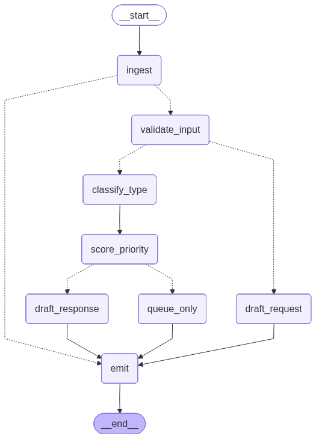

#  AGETIC — Triagem Inteligente de Chamados de TIC

> Sistema multiagente baseado em **LangGraph** para triagem automatizada de chamados de suporte de TI da UFMS, com interface web interativa via **Streamlit**.

---

##  Time 1

| Membro | Papel |
|---|---|
| Davi Gaborim | Desenvolvimento |
| Murilo Bassan | Desenvolvimento |
| Paola Campos | Desenvolvimento |
| Wellington Cintra | Desenvolvimento |

---

##  Sumário

1. [Visão Geral](#visão-geral)
2. [Arquitetura do Sistema](#arquitetura-do-sistema)
3. [O Grafo LangGraph](#o-grafo-langgraph)
4. [Descrição dos Nós](#descrição-dos-nós)
5. [Estrutura do Projeto](#estrutura-do-projeto)
6. [Pré-requisitos](#pré-requisitos)
7. [Instalação e Configuração](#instalação-e-configuração)
8. [Como Rodar](#como-rodar)
9. [Saídas Geradas](#saídas-geradas)
10. [Avaliação de Acurácia](#avaliação-de-acurácia)
11. [Testes](#testes)

---

## Visão Geral

O projeto automatiza o processo **3.1 da AGETIC/UFMS**: triagem inteligente de chamados de suporte de TIC. Em vez de um atendente humano ler e categorizar manualmente cada chamado, um pipeline de agentes de IA faz isso de forma automática, determinando:

- **Categoria** do chamado (Incidente, Requisição ou Problema)
- **Urgência** e **Impacto** (escala de 1 a 5)
- **Prioridade final** calculada deterministicamente (escala de 1 a 5)
- **Departamento** responsável pelo atendimento
- **Roteamento**: resposta automática ou fila para analista humano
- **Rascunho de resposta** ao usuário (quando aplicável)

O sistema expõe **duas interfaces**:

| Interface | Arquivo | Descrição |
|---|---|---|
| **Web (Streamlit)** | `app.py` | Dashboard visual com seletor de chamados, execução interativa e painel de resultados |
| **Batch (CLI)** | `main.py` | Processa lotes de chamados do dataset e calcula métricas de acurácia |

---

## Arquitetura do Sistema

```
Entrada (ticket JSON)
        │
        ▼
  ┌───────────┐
  │  ingest   │ ← Valida schema Pydantic e normaliza o ticket
  └─────┬─────┘
        │
        │ conditional edge (validation_response)
        │
        ├─── [validation_status == False] ─────────────────────────────────────────────────┐
        │                                                                                  │
        ▼ [True]                                                                           │
 ┌──────────────┐                                                                          │
 │validate_input│ ← LLM avalia se o texto tem informação                                   │
 └──────┬───────┘   suficiente para ser processado                                         │
        │                                                                                  │
        │ conditional edge (decide_content)                                                │
        │                                                                                  │
        ├─── [needs_more_info == False] ──────────────────────────────┐                    │
        │                                                             │                    │
        ▼ [True]                                                      │                    │
 ┌───────────────┐                                                    │                    │
 │ classify_type │ ← LLM classifica categoria, serviço,               │                    │
 └──────┬────────┘   nível e departamento                             │                    │
        │                                                             │                    │
        ▼                                                             │                    │
 ┌───────────────┐                                                    │                    │
 │score_priority │ ← Urgência e Impacto em paralelo                   │                    │
 └──────┬────────┘   + prioridade determinística                      │                    │
        │                                                             │                    │
        │ conditional edge (decide_response)                          │                    │
        │                                                             │                    │
        ├─── [(Prio ≤ 3 & Req) ou (Prio ≤ 2 & Incidente)] ──┐         │                    │       
        │                                                   │         │                    │
        ▼ [Outros casos]                                    ▼         ▼                    │
┌─────────────────┐                              ┌────────────────┐ ┌────────────────┐     │
│   queue_only    │                              │ draft_response │ │ draft_request  │     │
│                 │                              │                │ │                │     │
│ Alta prioridade │                              │ Gera rascunho  │ │ Pede mais infos│     │
│ → humano        │                              │ de resposta    │ │ ao usuário     │     │
└───────┬─────────┘                              └────────┬───────┘ └───────┬────────┘     |
        │                                                 │                 │              |
        └─────────────────────────────────────────────────┴─────────────────┴──────────────┘
                                        │
                                        ▼
                                  ┌──────────┐
                                  │   emit   │ ← Salva JSON, atualiza CSV
                                  └────┬─────┘
                                       │
                                       ▼
                                    [ END ]
```

---

## O Grafo LangGraph

Abaixo está o grafo gerado automaticamente pelo LangGraph ao inicializar o sistema:



As **linhas sólidas** representam arestas fixas (fluxo garantido). As **linhas tracejadas** representam arestas condicionais, onde a lógica de roteamento é executada em Python com base no estado atual do ticket.

---

## Descrição dos Nós

### `ingest`
**Arquivo:** `nodes/ingest.py`

Porta de entrada do pipeline. Recebe o JSON bruto do chamado e valida sua estrutura usando um modelo Pydantic (`IngestTicket`). Se o schema for inválido, marca `validation_status = False` no estado, e o grafo curta-circuita diretamente para `emit`, devolvendo o erro de validação como resposta.

**Saída do estado:**
- `ticket`: objeto normalizado
- `response.validation_status`: `True` ou `False`

---

### `validate_input`
**Arquivo:** `nodes/validate_input.py`

Chama o LLM com o texto livre do chamado (`free_text`) para determinar se há informação suficiente para prosseguir com o processamento. O modelo responde em JSON com os campos `needs_more_info` (bool) e `justification`.

**Aresta condicional (`decide_content`):**
- `needs_more_info = True` → vai para `draft_request`
- `needs_more_info = False` → vai para `classify_type`

---

### `classify_type`
**Arquivo:** `nodes/classify_type.py`

O LLM atua como analista N1 da UFMS e classifica o chamado respondendo em JSON com os campos:

| Campo | Descrição |
|---|---|
| `category` | Incidente, Requisição ou Problema |
| `service_type` | Tipo específico do serviço |
| `support_level` | Nível de suporte necessário (inteiro) |
| `category_justification` | Justificativa textual da classificação |
| `department` | Departamento responsável |

O prompt (`prompts/classify_type_prompt.md`) instrui o modelo a nunca retornar campos nulos e a usar few-shot examples internos.

---

### `score_priority`
**Arquivo:** `nodes/score_priority.py`

O nó mais sofisticado do pipeline. Opera em **3 etapas**:

**Etapa 1 — Paralelo:** Urgência e Impacto são avaliados simultaneamente pelo LLM usando `ThreadPoolExecutor(max_workers=2)`, reduzindo a latência total.

**Etapa 2 — Determinístico:** A prioridade final é calculada em Python, sem depender do LLM:

```python
def _calculate_priority(urgency: int, impact: int) -> int:
    raw = (max(urgency, impact) + round((urgency + impact) / 2)) / 2
    return max(1, min(5, round(raw)))
```

Essa fórmula pondera o valor máximo (pior caso) com a média aritmética, evitando extremos isolados.

**Etapa 3 — Justificativa:** Uma chamada LLM final gera uma justificativa textual com base nos três valores.

**Fail-safe:** Se o LLM falhar em qualquer etapa, o nó eleva a prioridade ao máximo (`5`) e encaminha automaticamente para fila humana, garantindo que nenhum chamado crítico seja perdido.

**Aresta condicional (`decide_response`):**
- `prioridade ≤ 3` **e** `categoria == "requisicao"` **ou** `prioridade ≤ 2` **e** `categoria == "incidente"`→ `draft_response`
- Caso contrário → `queue_only`

---

### `draft_response`
**Arquivo:** `nodes/draft_response.py`

Gera um rascunho de resposta ao usuário final para chamados de baixa e média prioridade e categorias "Requisição" e "Incidente". Usa few-shot examples específicos por departamento (`build_few_shot(department)`) para personalizar o tom e o conteúdo da resposta.

---

### `draft_request`
**Arquivo:** `nodes/draft_request.py`

Acionado quando o texto do chamado não tem informação suficiente. Gera uma mensagem educada solicitando mais detalhes ao usuário antes de prosseguir com o processamento.

---

### `queue_only`
**Arquivo:** `nodes/queue_only.py`

Enfileira chamados de alta prioridade ou categoria complexa para revisão por analista humano. Persiste a entrada no arquivo `data/human_queue.json` e marca o rascunho de resposta como `[FILA HUMANA]`.

---

### `emit`
**Arquivo:** `nodes/emit.py`

Nó terminal do pipeline. Consolida o estado final e:
1. Salva um JSON individual em `responses_json/ticket_{id}.json`
2. Atualiza (ou cria) o relatório `report.csv` com os dados do chamado
3. Retorna a mensagem de encerramento padrão da AGETIC

---

## Estrutura do Projeto

```
hackathon-mda/
├── app.py                           # Interface web Streamlit
├── main.py                          # Execução em batch (CLI)
├── graph_builder.py                 # Definição e compilação do grafo LangGraph
├── accuracy.py                      # Cálculo de métricas de acurácia
├── requirements.txt
├── .env.example                     # Template de variáveis de ambiente
│
├── nodes/                           # Nós do grafo (um arquivo por nó)
│   ├── ingest.py
│   ├── validate_input.py
│   ├── classify_type.py
│   ├── score_priority.py
│   ├── draft_response.py
│   ├── draft_request.py
│   ├── queue_only.py
│   └── emit.py
│
├── state/                           # Tipagem do estado do LangGraph
│   ├── state.py                     # State (TypedDict principal)
│   ├── ticket.py                    # Tipo Ticket
│   └── response.py                  # Tipo Response
│
├── prompts/                         # System prompts dos nós LLM (Markdown)
│   ├── classify_type_prompt.md
│   ├── validate_input_prompt.md
│   ├── draft_response_prompt.md
│   ├── draft_request_prompt.md
│   ├── score_urgency_prompt.md
│   ├── score_impact_prompt.md
│   └── justify_priority_prompt.md
│
├── utilities/                       # Funções auxiliares
│   ├── config.py                    # Caminhos centralizados (Path)
│   ├── utils.py                     # call_llm() — cliente OpenRouter
│   ├── decide_content.py            # Edge: validate_input → próximo nó
│   ├── decide_response.py           # Edge: score_priority → próximo nó
│   ├── validation_response.py       # Edge: ingest → próximo nó
│   ├── build_few_shot.py            # Monta exemplos few-shot por departamento
│   ├── ingest_ticket.py             # Modelo Pydantic IngestTicket
│   ├── load_tickets.py              # Carrega dataset JSON
│   ├── process_ticket.py            # Processa um ticket individualmente
│   ├── prompt_loader.py             # Lê arquivos .md de prompts
│   ├── save_graph_visualization.py  # Gera graph.png
│   └── logger_config.py             # Configuração do logger
│
├── data/
│   ├── data.json                    # Dataset de chamados (ground truth)
│   └── human_queue.json             # Fila de chamados para humanos (gerado)
│
├── responses_json/                  # JSONs individuais por ticket (gerado)
├── logs/
│   └── execucao.log                 # Log de execução (gerado)
├── report.csv                       # Relatório consolidado (gerado)
└── graph.png                        # Visualização do grafo (gerado)
```

---

## Pré-requisitos

- **Python 3.10+**
- Conta na [OpenRouter](https://openrouter.ai/) com créditos e uma chave de API
- (Opcional) `pip` ou `uv` para gerenciamento de dependências

---

## Instalação e Configuração

### 1. Clone o repositório

```bash
git clone <url-do-repositorio>
cd hackathon-mda
```

### 2. Crie e ative um ambiente virtual

```bash
python -m venv .venv

# Linux / macOS
source .venv/bin/activate

# Windows
.venv\Scripts\activate
```

### 3. Instale as dependências

```bash
pip install -r requirements.txt
```

### 4. Configure as variáveis de ambiente

Copie o arquivo de exemplo e preencha com seus dados:

```bash
cp .env.example .env
```

Edite o `.env`:

```env
OPENROUTER_API_KEY=sk-or-...   # Sua chave da OpenRouter
MODEL_NAME=google/gemma-3-27b-it  # Modelo a usar (padrão)
```

> **Dica:** Qualquer modelo disponível na [OpenRouter](https://openrouter.ai/models) pode ser usado. O padrão é `google/gemma-3-27b-it`.

---

## Como Rodar

### Interface Web (Streamlit) — recomendado para demos

```bash
streamlit run app.py
```

Acesse em: `http://localhost:8501`

**Funcionalidades da interface:**
- Seletor de chamados do dataset com preview de texto
- Toggle para usar dados reais ou digitar um chamado manualmente
- Execução do pipeline completo com status de progresso
- Dashboard de resultados com: Prioridade, Urgência, Impacto, Categoria
- Banner de alerta dinâmico (verde / laranja / vermelho conforme prioridade)
- Painel de Justificativa da IA e Rascunho de Resposta
- Visualizador JSON do estado completo (expander técnico)
- Terminal de logs em tempo real na sidebar

---

### Modo Batch (CLI)

```bash
python main.py
```

O modo batch processa tickets do dataset em faixa configurável. Edite `main.py` para definir o intervalo:

```python
START_INDEX = 0   # índice de início (inclusive, 0-based)
END_INDEX   = 10  # índice de fim (exclusive)
```

Ao finalizar, executa automaticamente `run_accuracy()` para calcular as métricas.

---

## Saídas Geradas

| Arquivo/Pasta | Conteúdo |
|---|---|
| `graph.png` | Visualização do grafo LangGraph gerada na inicialização |
| `responses_json/ticket_{id}.json` | Resultado completo de cada chamado processado |
| `report.csv` | Relatório consolidado de todos os tickets processados |
| `data/human_queue.json` | Fila de tickets encaminhados para analista humano |
| `logs/execucao.log` | Log completo de execução com timestamps |

### Exemplo de resposta JSON (`responses_json/ticket_TKT-UFMS-001.json`)

```json
{
  "ticket_id": "TKT-UFMS-001",
  "category": "Requisição",
  "urgency": 2,
  "impact": 1,
  "resulting_priority": 2,
  "priority_justification": "Solicitação padrão sem impacto crítico nos serviços.",
  "service_type": "Acesso a Sistema",
  "support_level": 1,
  "category_justification": "Pedido de acesso a recurso institucional.",
  "department": "STI",
  "response_draft": "Olá, recebemos sua solicitação de acesso..."
}
```

---

## Avaliação de Acurácia

O módulo `accuracy.py` compara as respostas geradas pelo pipeline com os dados de ground truth do `data/data.json`. As métricas calculadas incluem:

| Métrica | Descrição |
|---|---|
| **Acurácia de Categoria** | % de chamados com categoria correta |
| **Acurácia de Prioridade** | % com nível de prioridade correto |
| **Acurácia de Departamento** | % com departamento correto |
| **Resolvidos pelo LLM** | % encaminhados para resposta automática |
| **Encaminhados para humano** | % mandados para fila humana |
| **Validação bem-sucedida** | % aprovados no schema Pydantic |

---

## Testes

O projeto conta com suíte de testes automatizados em `tests/`:

```bash
# Rodar todos os testes
pytest tests/

# Com verbose
pytest tests/ -v

# Apenas testes de nós
pytest tests/test_nodes.py -v

# Apenas testes de arestas
pytest tests/test_edges.py -v

# Execução de todos os testes com cobertura
pytest tests/ -v --cov=nodes --cov=utilities --cov-report=term-missing
```

| Arquivo | Cobertura |
|---|---|
| `tests/test_nodes.py` | Comportamento de cada nó individualmente |
| `tests/test_edges.py` | Lógica das arestas condicionais |
| `tests/conftest.py` | Fixtures compartilhadas (estados mockados) |

---

## Fluxo de Decisão — Resumo Visual

```
          ticket recebido
                 │
                 ▼
          schema válido? ────────── NÃO ──→ emit (erro de validação)
                 │
                 ▼ SIM
         texto suficiente? ──────── NÃO ──→ draft_request → emit
                 │
                 ▼ SIM
          classificar tipo
                 │
                 ▼
 calcular urgência + impacto (paralelo)
           → prioridade
                 │
                 ▼
prioridade ≤ 3 e categoria = "Requisição"
                 OU
prioridade ≤ 2 e categoria = "Incidente"?
                 │
                 ├── SIM ──→ draft_response → emit
                 │
                 ▼ NÃO
            queue_only → emit (fila humana)
```

---

## Contato e Suporte

Dúvidas sobre o sistema AGETIC/UFMS:

- **E-mail:** suporte.agetic@ufms.br
- **Telefone:** (67) 3345-7292

---

*Desenvolvido durante o Hackathon MDA — Time 1 — UFMS, 2026.*
